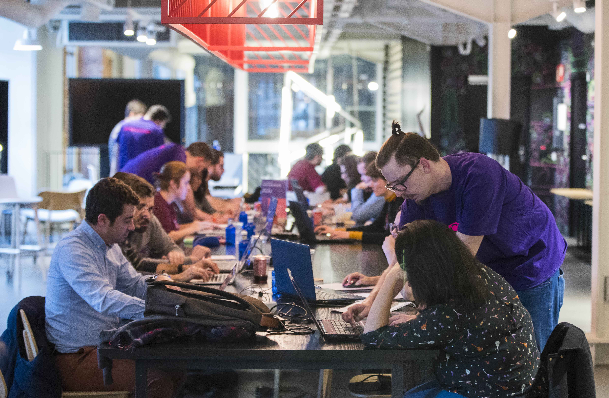
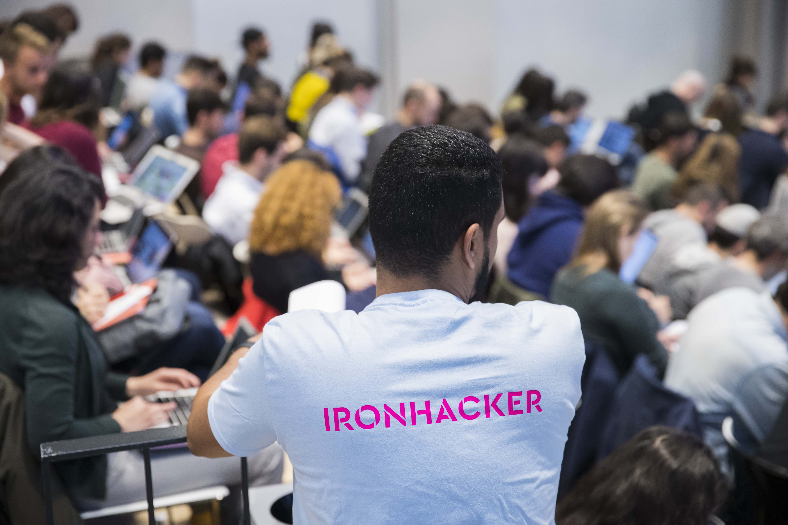
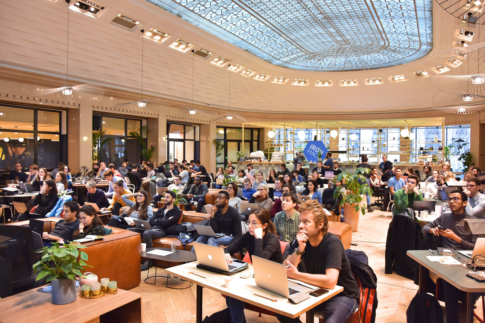

Out of the blue, last month, one of the most prominent startups in town invited me to lecture their marketing team about the lessons we (at Ironhack) have learned building our amazing community.

On one hand, I was happily surprised they extended such invitation. Just the fact their top-notch marketing team was curious about our community building efforts was a pleasant wink at our work, and something we should definitely feel proud of.

On the other hand, there was this nagging thought I couldn't get off my head: the more I mulled over the content of the presentation, the more I felt I truly didn't know what to say or even where to start.

At Ironhack, our community is one of our most precious assets. We devote tons of time and resources to [develop and nurture](/blog/2015/wecode) it, without even expecting the slightest return in the short term. We do it because we care. Because we truly believe it is the right thing. But I had never written down an ordered list with our tactics or how-tos when it comes to building a community.

To begin with, I am neither expert in marketing nor I thought of myself as knowledgeable about community-related strategies. But since I wanted to prepare the lecture, I started drafting ideas, thoughts... and dived deep into the *raison d'être*, the building blocks of our community.  I rejoiced and found the exercise fascinating and I wanted to share a few lines with some of the takeaways.

## Why Do You Want One?
First of all, it is important to understand why, nowadays, all the cool kids want to run their own communities. The upsides of a healthy community are well understood and kickstarting one seems rather easy. But the hidden challenges of building and nurturing one are far less documented.

A community is neither a *build it and they will come* thing, nor a passive asset that takes care of itself. It takes time, resources and dedication. Most people don't have time and usually, resources are constrained or better allocated to other, shorter term, projects. That's the number one reason communities don't endure, they lack care and fade away.

> I have witnessed countless community attempts announcing their brand new thing. Over time I have learned to contemplate it with a deeper perspective and wonder how many of those will still be there in the long run.

This is the first realization I came across: your community must be embedded in your DNA. In other words, unless you run an NGO, the community must be supporting and reinforcing some aspects of your culture or business model. Otherwise, chances are you will fail to invest in it. Incentives matter, a lot.

In order to thrive, your community must be [deeply integrated](/blog/2017/alignment) into the way your business operates. That means all your stakeholders should derive value from nurturing the community and your business should get healthier when the community is engaged.

## Identity, Product, Partners
But back to our community at Ironhack. After giving it a lot of thought, I came to realize our community reinforces three key aspects of our business and culture: identity, product, and partners — this last one dealt in a separate post.

When it comes to identity, there are many factors playing in, some of them we control, others we do not. A community is something you can, to some extent, manage or control, but its implications extend far beyond what you might presume. Our community shapes the way people perceive us: what they say about us, how we look like in people's minds and, ultimately, how we fit in the world.

> I find fascinating this ability to ultimately control the shape of our own perception. We do it through our events, the strategic involvement of alumni, random interactions around campus, all of it, every single bit adds up. It is a reflection of our culture, one in which our community is deeply built in.

I don't know why, but at the end of the day, I picture some friends, having this informal conversation over dinner. They talk about us without *us* being there, and this is exactly how our identity spreads without our full control. Nowadays when we (almost) can send a rocket to Mars, the most powerful referral is still the word of mouth. Therefore, each member of your community will define who you are, one interaction at a time.

But of course, we need to constantly remind ourselves that we are here to deliver an amazing educational experience. It is precisely at this point where the integration with our product is the most transformative.

At this moment in time, where all educational content is being commoditized and distributed for free, the [experience](/blog/2016/ironhack-experience) becomes not only more important but essential when it comes to having the best product. Given this environment, I would argue that our community is the most powerful asset we have to compete in this new *axis of performance*.

Our community is the answer to the question: how are you different than your competitors? Why are you a better choice? I once struggled with answering this question. But now I see it crystal clear: a strong, deeply engaged community is the most powerful answer to why you should join Ironhack.

## Community and Culture
I like this idea of defining culture as *what happens when nobody is looking*. Sometimes we take it for granted, but in a way, community and culture are two sides of the same coin.

Alumni, hiring partners, other friendly groups, public institutions... all of them orbit around us, helping create a unique environment for our students to [develop their craft](/blog/2017/curiosity). Scattered people working together under the Ironhack theme to provide an educational experience that none of our students would forget.

> This idea of community doesn't come naturally to me. Like it or not, my engineering background makes me perceive the world in 0s and 1s. A community is an extremely complex artifact composed of the most polyhedral entities: human beings. This makes analyzing, even talking about community a really challenging endeavor.

But also simpler things, from how we deal with the dishes after lunch to how we open the door and receive random people to our campus. Definitely not something we have fully engineered, but figure it out by doing, by imprinting our care and passion for what we do.

It is our culture who attracts our community, and at the end of the day, all of it happens because we care to the extent other people would think we are insane. The amount of attention and devotion we put to everything we do goes way past sanity by standard metrics. All of us want to see our culture winning, and this feeling radiates across the whole organization.

## Building Yours
As we discussed, community (potentially) pays off in the long run. Its growth follows kind of an exponential path. At the very beginning, you feel like you are investing plenty of time and resources, but cashing almost no returns. The early efforts clearly do not scale and most attempts fail at this stage.

Past a certain point, your community will greatly pay off, but most won't make it there. Building and scaling a healthy community is not an easy endeavor and the future returns can't be your primary motivation.

A community is an end in itself, one you must appreciate, care and nurture beyond rationality or balance sheets. The main takeaway of these lines is that the community is one of the most powerful tools to differentiate and build your business on. But the approach when it comes to creating yours, can't be transactional. You must definitely care, love what you do, only then gravity will do the rest.
