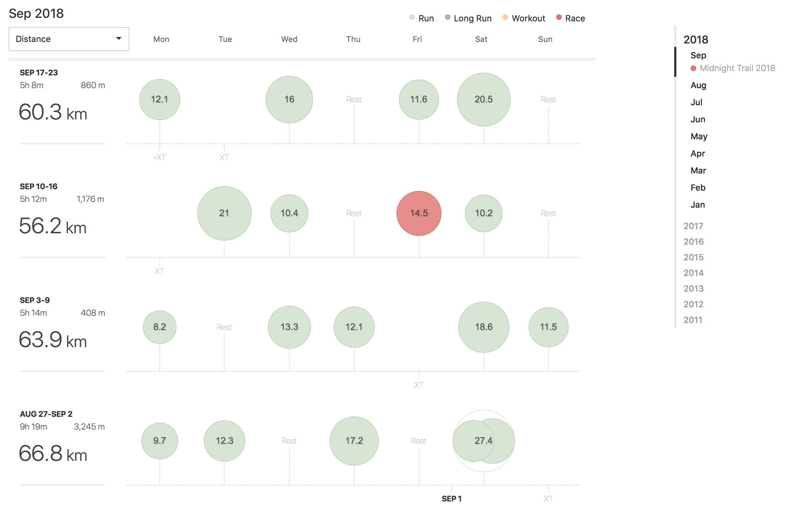
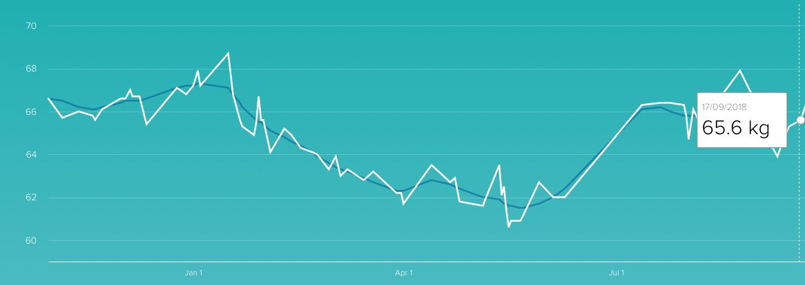

It’s been over a month since I started planning for the sub3 project. In my mind, this first month was all about getting things up and running, building the habit, the momentum that will eventually become the foundation for the project. Yet sincerely, the results have blown my wildest expectations, I couldn’t have imagined a better, more steady start.

I feel the need to [bring back Steve](/blog/2018/book-war-art) here, just to remind me what I got wrong the last time, but also what fueled me this last month — and hopefully what will keep me going in the future.

> How many pages have I produced? I don't care. Are they any good? I don't even think about it. All that matters is I've put in my time and hit it with all I've got. All that counts is that, for this day, for this session, I have overcome Resistance.

In a nutshell, this is what me overcoming Resistance looks like 👇

Still far from my PRs, though, the almost 250km I clocked this month have taken the "laziness cloud" out of the picture and put me in a position to start pushing these times down during October.

## Retrospective
Note that almost half of the training volume was performed on trails — hence the unusually high positive altitude gained — because of two upcoming trail races during September I wanted to prepare for. Notwithstanding, I also had the chance to combine it with a handful of interval sessions in the track.

As I mentioned before, I’m not currently following any strict training plan. I just try to combine fast-paced intervals with slower, longer runs, and simply rest when I feel tired or overtrained. Kind of common sense, but nothing structured nor organized.

Later this month, though, I started to dig a little deeper into training plans in order to approach the sub3 hour marathon more scientifically, if such thing exists. I know I’ll be following a plan eventually, but first I wanted to focus on getting the "basics" right, and consolidate the habit of training four to five times per week. In other words, reliable proof that I could do it, by demonstrating to myself that I could commit to training.

That’s the main reason why I still don’t have any metrics to "obsess" with. I wanted to start with a softer approach and meanwhile, use this time to learn about the craft and set for the appropriate metrics when the time comes.

On the other hand, whilst not following a strict routine or optimizing for a set of metrics, I’m trying to ensure the right balance of performance across these five pillars:

* Train — and rest: seizing four to five sessions per week, making sure I'm training hard, but most importantly, I plan and respect the days off.
* Stretch: something I’ve never paid attention to before, but now taking into serious account. I'm making huge progress on this area, as flexible as I’ve never been 🤸‍♂️
* Sleep: that's simple, aiming for 8 hours per day, no excuses.
* Eat: yikes... say hi to the pillar with more room for improvement. I’m currently overeating, no secret: around 3200kcal per day and doing an especially poor job with regards to sugar. This is definitely homework that carries over to the next month.
* Meditate: I want to bundle meditation into the whole performance pack, and despite it might not be strictly related, I’m convinced it will help me thrive in the long run.

Next month, with more data available, I will break this section down with the classic `Good | Bad | To Improve` framework. This month, though, clearly could have benefited from less eating and a little bit more sleep.

## Metrics
As I said, it is still early to start looking at the data. Yet a certain data-driven personality comes by default. And while I want to use it to improve my marks, I don’t want the data-obsessed side of me to take over and run the entire show.

The first month remains about setting everything up and creating momentum. Get this foundation right, and metrics will inevitably follow. For the time being, just to ensure I’m not plateauing and making healthy progress, here are some basics:

* Volume: 247.2km
* 1k: 00:00:33 — the 21st of September
* 10k: 00:43:45 — the 19th of September
* Half marathon: n/a
* VO2max[^1]: up from 52 to 59

Another "easy one" I could add to the equation is weight. Although it comes already factored into the PRs — less weight means less energy required to push the body, thus better performance — I think is also a good metric to keep an eye on, especially given the fact that eating is by far the biggest area for improvement.

Here's my weight log these lasts months 👇

## Coming Up
Next month I want to maintain the momentum and clock 200 to 220km. This is less than this month because the 29th of September I’ll be running the [Mitja Pirineus](http://ultrapirineu.com/en/mitja) and I don’t want to show up there overtrained, so a little bit of rest will be welcome during the early phase of the month.

On top of that, I’ve got a few trips booked for October — that will certainly disrupt a little bit my training agenda. Nonthelesss, I’m aiming for new PRs for the 10k, below 00:43:00, and also completing the first half marathon training, below 01:40:00.

So, my homework for the next month 👇

* Volume: 200 — 220km
* 10k: <00:43:00
* Half marathon: <01:40:00
* Mitja Pirineus: <01:55:00
* Improve eating habits — get weight down to 63.5kg
* Start meditating
* Research about training plans

---
[^1]: I've read plenty of research pointing out that wrist heart rate based VO2max is not the most accurate way to estimate this value, but since my watch provides it, I thought it was cool to include it as well.